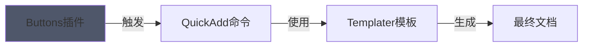

```button
name Tailwind V4
type link
action https://tailwindcss.com/docs/installation/using-postcss
color blue
class shadow-button
```
^button-tailwind

```button
name 白土收藏室
type link
action https://collection.jituc.cn
color green
class shadow-button
```
^button-collection

```button
name Arco Design
type link
action https://arco.design
color purple
class shadow-button
```
^button-arco

```button
name Semi Design
type link
action https://semi.design
color orange
class shadow-button
```
^button-semi

```button
name v0.dev
type link
action https://v0.dev
color grey
class shadow-button
```
^button-v0

```button
name MDN
type link
action https://developer.mozilla.org/zh-CN/docs/Web/CSS/background-image
color grey
class shadow-button
```
^button-mdn


```button
name 知乎
type link
action https://www.zhihu.com/column/c_1620378540351922176
color grey
class shadow-button
```
