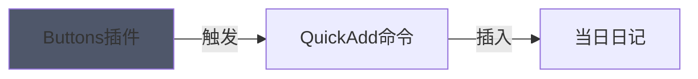

```mermaid
graph LR
    B[Buttons插件] -->|触发| Q[QuickAdd命令]
    Q -->|插入| F[当日日记]
    style B fill:#4F576A
```


【记录流水帐】

```button
name 闪念动态Memos Zone
type command
action QuickAdd: 日记操作：闪念笔记
```
^button-memosZone

【规划日程】

【闪念memos zone】

