```mermaid
graph LR
    B[Buttons插件] -->|触发| Q[QuickAdd命令]
    Q -->|插入| F[当日日记]
    style B fill:#4F576A
```

【记录流水帐】

```button
name 💭闪念动态 gun Memos Zone
type command
action QuickAdd: 日记操作：闪念笔记
class grad_tiny_button
```
^button-memosZone

【规划日程】

```button
name 🧾规划日程
type command
action QuickAdd: 日记操作：规划日程
class grad_tiny_button
```
^button-dailyPlan


【闪念memos zone】

```button
name ✍️流水帐
type command
action QuickAdd: 日记操作：记录流水帐
class grad_tiny_button
```
^button-runningAccount


