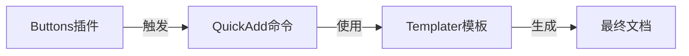

https://silentvoid13.github.io/Templater/

obsidian templater文档。




    style B fill:#a8d5ff
    style Q fill:#ffb3b3
    style T fill:#b3ffb3
    style F fill:#e6e6e6


```button
name 📷记录一条说说memo
type command
action 日记: 打开/创建今天的日记
class grad_tiny_button
customColor #e64553
```
^button-zone

```button
name 📝新建一个普通文章
```

```button
name 💻引用一份参考来源
```

```button
name 🤖援引一则AI内容
```

```button
name 💬发布一篇网络创作
```