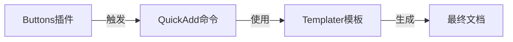

https://silentvoid13.github.io/Templater/

obsidian templater文档。




zhu'yao

    style B fill:#a8d5ff
    style Q fill:#ffb3b3
    style T fill:#b3ffb3
    style F fill:#e6e6e6


> [!note]+ AI设计的按钮
> 
> 
> ```button
> name 📷记录一条说说memo
> type command
> action 日记: 打开/创建今天的日记
> class grad_tiny_button
> customColor #e64553
> ```
> 
> ```button
> name 📝新建一个普通文章
> type command
> action QuickAdd:从模板新建一篇普通文章
> class grad_tiny_button
> customColor #4CAF50
> ```
> 
> ```button
> name 💻引用一份参考来源
> type command
> action QuickAdd:转载的参考文章
> class grad_tiny_button
> customColor #2196F3
> ```
> 
> ```button
> name 🤖援引一则AI内容
> type command
> action QuickAdd:Al的参考文章
> class grad_tiny_button
> customColor #9C27B0
> ```
> 
> 选用了四种柔和的主色：
> - 红色 #e64553
> - 绿色 #4CAF50
> - 蓝色 #2196F3
> - 紫色 #9C27B0
> 


```button
name 📷记录一条说说memo
type command
action 日记: 打开/创建今天的日记
class grad_tiny_button
customColor #e64553
```
^button-zone

```button
name 📝新建一个普通文章
type command
action QuickAdd:从模板新建一篇普通文章
class grad_tiny_button
customColor #4CAF50
```
^button-md

```button
name 💻引用一份参考来源
type command
action QuickAdd:转载的参考文章
class grad_tiny_button
customColor #2196F3
```
^button-ref-webBookmark

```button
name 🤖援引一则AI内容
type command
action QuickAdd:Al的参考文章
class grad_tiny_button
customColor #9C27B0
```
^button-ref-AI

```button
name 💬发布一篇网络创作
```
