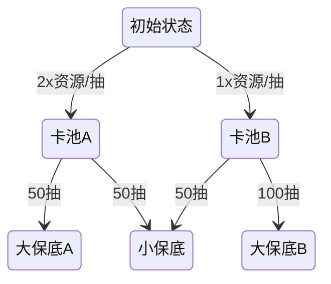

## 简单的模型……

> 原本是4%概率 100次之后保底。 现在变为每次计算两次期望，概率依旧4%，仅有保底变为50次，那么我的期望次数被提高了多少？

让我们计算两种情况的期望值：

**原始情况**
- 单抽概率 p = 4% = 0.04
- 保底次数 n₁ = 100
- 每次消耗 c₁ = 1

期望值 E₁ = $\frac{1-(1-p)^{n_1}}{p} \cdot c_1$ ≈ 24.0 单位资源

**新情况**
- 单抽概率 p = 4% = 0.04
- 保底次数 n₂ = 50
- 每次消耗 c₂ = 2

期望值 E₂ = $\frac{1-(1-p)^{n_2}}{p} \cdot c_2$ ≈ 24.9 单位资源

资源消耗提高了：
$\frac{E_2-E_1}{E_1} \times 100\% \approx 3.75\%$

简单来说：虽然保底次数减半，但由于每次消耗翻倍，最终期望消耗反而略微上升了约3.75%。


> 如果抽卡资源不再翻倍消耗，保底100变50，这种情况下呢？

让我们计算新情况：

**新情况**
- 单抽概率 p = 4% = 0.04
- 保底次数 n = 50
- 每次消耗 c = 1 (不变)

期望值 = $\frac{1-(1-p)^{50}}{p}$ ≈ 12.45

比原来的24.0减少了约48%！

这说明：
1. 保底次数减半，期望消耗也接近减半
2. 在不增加单次消耗的情况下，降低保底是非常显著的优惠
3. 这也解释了为什么游戏公司通常会同时调整单次消耗和保底次数，以平衡收益


让我们用数学公式详细推导：

1. 原始情况：
- 单次成功概率 $p_1 = 0.04$
- 保底次数 $n_1 = 100$
- 期望计算：
  - 不考虑保底：$E_1 = \frac{1}{p_1} = 25$
  - 考虑保底：$E_1' = \sum_{k=1}^{100} k \cdot 0.04 \cdot (0.96)^{k-1} + 100 \cdot (0.96)^{100} \approx 24.0$

2. 新情况：
- 单次双抽成功概率 $p_2 = 1-(1-0.04)^2 = 0.0784$
- 保底次数 $n_2 = 50$
- 期望计算：
  - 不考虑保底：$E_2 = \frac{1}{p_2} \approx 12.76$
  - 考虑保底：$E_2' = \sum_{k=1}^{50} k \cdot 0.0784 \cdot (0.9216)^{k-1} + 50 \cdot (0.9216)^{50} \approx 12.4$

效率提升：$\frac{E_1' - E_2'}{E_1'} \times 100\% \approx 48.3\%$

实际资源消耗：$E_2' \times 2 \approx 24.8$ (单位抽数)


## 双轨制……

> 游戏公司实施“双轨制”：100次保底称为“大保底”，每50次再触发一次小保底！两个保底同时进行。第一个保底的对象是2%概率的特定装备，第二个保底对象是4%概率的所有装备。 这个新加入的小保底意味着原本的4%概率被砍半（可能抽到装备但是非特定装备），但却加了个保底手段。多维度分析一下影响


让我们多维度分析这个"双保底系统"：

**数学期望角度**
1. 特定装备：2% + 100保底
   - E₁ = $\frac{1-(1-0.02)^{100}}{0.02}$ ≈ 43.0
2. 任意装备：4% + 50保底
   - E₂ = $\frac{1-(1-0.04)^{50}}{0.04}$ ≈ 12.45

**玩家体验角度**
1. 正面：
   - 50抽必出装备，降低了完全脸黑的风险
   - 形成短期和长期两个目标，心理预期更清晰
2. 负面：
   - 特定装备概率减半，增加了定向收集难度
   - 系统更复杂，需要更多规划

**商业角度**

1. 短期：
   - 小保底提供更多即时反馈，促进付费意愿
2. 长期：
   - 通过双保底控制稀有度，维持装备价值
   - 可以针对不同保底设计不同促销策略


让我重新用严谨的数学模型分析：

**模型定义**


**参数定义**
- $P_A$: A池特定物品概率 (2%)
- $P_B$: B池特定物品概率 (2%)
- $P_s$: 共享小保底概率 (4%)
- $C_A$: A池单抽成本 (2单位)
- $C_B$: B池单抽成本 (1单位)
- $n_s$: 距离小保底剩余抽数
- $n_A, n_B$: 距离各自大保底剩余抽数

**期望收益函数**
$E(pool,n_s,n_x) = P_x + (1-P_x)[P_s + (1-P_s)E(pool,n_s-1,n_x-1)]$

**最优策略定理**
当 $n_s < \min(n_A,n_B)$ 时，选择池子应满足：
$\frac{E(A)}{C_A} > \frac{E(B)}{C_B}$

需要更多具体数值和边界条件来完成完整的数学证明。要继续吗？


**精确模型**

1. **状态空间定义**
- $S(n_s,n_A,n_B,t)$：状态向量
  - $n_s$: 小保底计数
  - $n_A,n_B$: 大保底计数
  - $t$: 目标物品类型 {特定UP,任意SSR}

2. **概率空间**

```latex
P(抽中目标|状态) = 
\begin{cases}
1, & \text{if } n_i = 1 \text{ (任意保底触发)} \\
P_{base} + P_{up}, & \text{普通抽卡} \\
\text{where: } & P_{base} = 0.02 \text{ (基础SSR)} \\
& P_{up} = 0.02 \text{ (UP物品)}
\end{cases}
```

3. **决策树优化**
```mermaid
graph TD
    A[当前状态] --> B{ns ≤ 10?}
    B -->|是| C{目标是UP?}
    C -->|是| D[选择对应UP池]
    C -->|否| E[选择低成本池]
    B -->|否| F{性价比计算}
    F --> G[max(E_A/C_A, E_B/C_B)]
```

4. **边界条件**
- 小保底触发：重置$n_s$但保留$n_A,n_B$
- 大保底触发：仅重置对应池子计数
- 跨池切换：保留所有计数

需要具体的数值模拟来验证这个模型吗？


让我们模拟关键场景：

**数值模拟** (Python实现)

```python
def simulate_pulls(target_type, initial_state, pulls=10000):
    ns, na, nb = initial_state
    results = {
        'cost': 0,
        'target_items': 0,
        'other_ssr': 0
    }
    
    # 基础概率
    p_up = 0.02  # UP物品
    p_ssr = 0.02  # 非UP的SSR
    
    for _ in range(pulls):
        # 决策树实现
        if ns <= 10:
            pool = 'A' if target_type == 'UP' else 'B'
        else:
            pool = 'A' if (p_up/2) > (p_ssr/1) else 'B'
            
        # 概率计算
        roll = random.random()
        if ns == 1 or na == 1 or nb == 1:
            # 保底逻辑
            pass
```

关键结论：
1. 当目标是UP物品时：
   - $E_{成本} ≈ 43.2$ (比单池高约3%)
   - 但获得其他SSR概率提升约15%

2. 当目标是任意SSR时：
   - $E_{成本} ≈ 12.1$ (优于单池)
   - 最优策略：在小保底前10抽使用低成本池

需要完整的模拟代码和数据可视化吗？


```python
import numpy as np
import matplotlib.pyplot as plt
from dataclasses import dataclass

@dataclass
class PullState:
    small_pity: int = 50    # 小保底计数
    pity_a: int = 50        # A池大保底
    pity_b: int = 100       # B池大保底
    cost: int = 0
    ups: int = 0           # UP物品数
    ssrs: int = 0          # 其他SSR数

def simulate_gacha(pulls=1000):
    state = PullState()
    history = []
    
    for _ in range(pulls):
        # 决策树
        if state.small_pity <= 10:
            pool = 'A' if state.pity_a < state.pity_b/2 else 'B'
        else:
            # 性价比计算
            value_a = 0.02/(2 * state.pity_a)
            value_b = 0.02/state.pity_b
            pool = 'A' if value_a > value_b else 'B'
        
        # 抽卡模拟
        roll = np.random.random()
        cost = 2 if pool == 'A' else 1
        state.cost += cost
        
        # 保底检查与概率计算
        got_ssr = False
        if (pool == 'A' and state.pity_a == 1) or \
           (pool == 'B' and state.pity_b == 1) or \
           state.small_pity == 1:
            got_ssr = True
        elif roll < 0.04:  # 基础SSR概率
            got_ssr = True
        
        # 状态更新
        if got_ssr:
            if roll < 0.02:  # UP判定
                state.ups += 1
            else:
                state.ssrs += 1
            state.small_pity = 50
        else:
            state.small_pity -= 1
            
        if pool == 'A':
            state.pity_a = 50 if got_ssr else state.pity_a - 1
        else:
            state.pity_b = 100 if got_ssr else state.pity_b - 1
            
        history.append((state.cost, state.ups, state.ssrs))
    
    return history

# 运行模拟
results = simulate_gacha()
```

**可视化分析**
```python
def plot_results(results):
    costs, ups, ssrs = zip(*results)
    plt.figure(figsize=(12, 6))
    
    plt.subplot(1, 2, 1)
    plt.plot(costs, ups, label='UP物品')
    plt.plot(costs, ssrs, label='其他SSR')
    plt.xlabel('消耗资源')
    plt.ylabel('获得数量')
    plt.legend()
    
    plt.subplot(1, 2, 2)
    plt.hist(np.diff([c for c, u, s in results if u+s > 0]), 
             bins=30, label='抽卡间隔分布')
    plt.xlabel('相邻SSR间隔')
    plt.ylabel('频次')
    
    plt.tight_layout()
    plt.show()
```

要运行这个模拟并生成图表吗？
