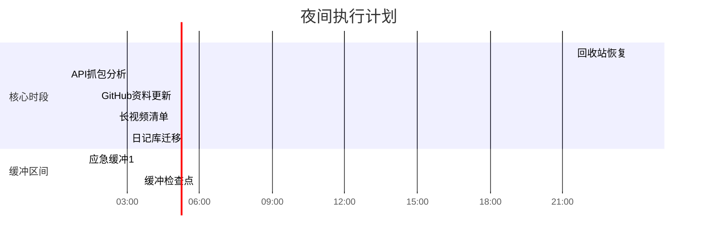

---
tags: [todo/list, planning/night]
created: 2025-02-01 23:47
target-sleep: 04:00 ~ 06:00
total-available: 4h13m
---

# 夜间冲刺计划 🌙
**可用时长**：≈4小时 (23:47 - 04:00)  
**能量管理**：建议每45分钟补充水分+拉伸，02:30左右补充轻零食

## 🚀 任务序列（优先级排序）
1. **[🔄 紧急恢复]** `30min`  
   - [ ] 回收站检索 `#win` `#文件恢复`
   - 路径：`C:\$Recycle.Bin\239CTF_Backup`
   - 执行后立即检查：`/assets/images/ctf/`目录完整性
   - 应急方案：若未找到，立即使用`Recuva`深度扫描

2. **[💻 技术攻坚]** `1h15m` `核心时段（00:30-01:45）`  
   - [ ] 源码精灵API抓包 `#逆向工程` `#wireshark`
   - 目标端口：`:3724, :8085`
   - 重点关注：`/api/v2/auth` 和物品交换协议
   - 存档位置：`逆向工程/私服研究/20250201_capture.pcapng`

3. **[📚 文档维护]** `45min`  
   - [ ] GitHub Profile更新 `#展示优化`
   - 新增模块：`### Obsidian数字花园` 
   - 需列库：CTF笔记库（公开）| 读书矩阵（私有）| 逆向工程日志（部分公开）
   - 添加库状态徽章：``

4. **[🧠 知识管理]** `30min`  
   - [ ] 创建长视频清单 `#学习跟踪`
   - 模板路径：`Templates/MediaList.md`
   - 需包含：{{最近3部网络安全讲座}} + {{Obsidian高级教程}}
   - 添加进度条：``

5. **[🔧 系统迁移]** `1h` `高耗能时段（03:00-04:00）`  
   - [ ] 日记库迁移规划 `#数据架构`
   - 检查冲突插件：`Day Planner` vs `Periodic Notes`
   - 测试方案：克隆库至`D:\Obsidian_Vaults/Diary_2025Beta`
   - 关键步骤：先迁移`/Daily/`目录，保留原库3天

## ⏳ 时间轴可视化

-----
我于 2025/02/02(周日) 00:52:14(+08:00) 凌晨  评论/留言了这篇文章：

>[!note]+ 评论内容：原文
>请你用obsidian的md格式写一个待办清单，我接下来要干六件事，帮我安排好：1. 找回上次【239 CTF】文件夹库搬迁过程中丢失的图片。目前似乎还在回收站 2. 写github个人简历加一个模块，列出我各种有趣的obsidian文档库的在github上的链接和状况 3. 继续抓包源码精灵私服研究api 5. 写一个obsidian文档列出我近期在看的长视频 6. 继续给obsidian日记库分离与搬迁做处理和打算。 现在是2025.2.1 23:47，我计划凌晨4点睡觉，最迟不超过六点

#【特殊tag】/有评论或留言的文章

