---
tags: [todo/list, planning/night]
created: 2025-02-01 23:47
target-sleep: 04:00 ~ 06:00
total-available: 4h13m
---

# 夜间冲刺计划 🌙
**可用时长**：≈4小时 (23:47 - 04:00)  
**能量管理**：建议每45分钟补充水分+拉伸，02:30左右补充轻零食

## 🚀 任务序列（优先级排序）
1. **[🔄 紧急恢复]** `30min`  
   - [ ] 回收站检索 `#win` `#文件恢复`
   - 路径：`C:\$Recycle.Bin\239CTF_Backup`
   - 执行后立即检查：`/assets/images/ctf/`目录完整性
   - 应急方案：若未找到，立即使用`Recuva`深度扫描

2. **[💻 技术攻坚]** `1h15m` `核心时段（00:30-01:45）`  
   - [ ] 源码精灵API抓包 `#逆向工程` `#wireshark`
   - 目标端口：`:3724, :8085`
   - 重点关注：`/api/v2/auth` 和物品交换协议
   - 存档位置：`逆向工程/私服研究/20250201_capture.pcapng`

3. **[📚 文档维护]** `45min`  
   - [ ] GitHub Profile更新 `#展示优化`
   - 新增模块：`### Obsidian数字花园` 
   - 需列库：CTF笔记库（公开）| 读书矩阵（私有）| 逆向工程日志（部分公开）
   - 添加库状态徽章：``

4. **[🧠 知识管理]** `30min`  
   - [ ] 创建长视频清单 `#学习跟踪`
   - 模板路径：`Templates/MediaList.md`
   - 需包含：{{最近3部网络安全讲座}} + {{Obsidian高级教程}}
   - 添加进度条：``

5. **[🔧 系统迁移]** `1h` `高耗能时段（03:00-04:00）`  
   - [ ] 日记库迁移规划 `#数据架构`
   - 检查冲突插件：`Day Planner` vs `Periodic Notes`
   - 测试方案：克隆库至`D:\Obsidian_Vaults/Diary_2025Beta`
   - 关键步骤：先迁移`/Daily/`目录，保留原库3天

## ⏳ 时间轴可视化

```mermaid
gantt
    title 夜间执行计划
    dateFormat  HH-mm
    axisFormat %H:%M
    section 核心时段
    回收站恢复       :23-50, 30min
    API抓包分析      :00-30, 75min
    GitHub资料更新   :01-45, 45min
    长视频清单       :02-30, 30min
    日记库迁移       :03-00, 60min
    section 缓冲区间
    应急缓冲1       :01-15, 15min
    缓冲检查点      :03-30, 30min
```



-----
我于 2025/02/02(周日) 00:52:14(+08:00) 凌晨  评论/留言了这篇文章：

>[!note]+ 评论内容：原文
>请你用obsidian的md格式写一个待办清单，我接下来要干六件事，帮我安排好：1. 找回上次【239 CTF】文件夹库搬迁过程中丢失的图片。目前似乎还在回收站 2. 写github个人简历加一个模块，列出我各种有趣的obsidian文档库的在github上的链接和状况 3. 继续抓包源码精灵私服研究api 5. 写一个obsidian文档列出我近期在看的长视频 6. 继续给obsidian日记库分离与搬迁做处理和打算。 现在是2025.2.1 23:47，我计划凌晨4点睡觉，最迟不超过六点

#【特殊tag】/有评论或留言的文章

# 第一项：CTF文件夹内附件恢复

**当前时间**：2025-02-02 00:55  
**紧急程度**：‼️ 需在01:30前完成恢复

## 🚨 现状分析
- **物理路径**：`E:\$RECYCLE.BIN\$RSP1THY` (回收站系统保护目录)
- **关键矛盾**：Windows回收站机制对批量操作不友好
- **风险预警**：直接操作可能触发文件覆盖（剩余磁盘空间：23.4GB）

## 🔑 三步恢复方案
### 步骤1：系统级批量还原

```powershell
# 以管理员身份运行 PowerShell
$shell = New-Object -ComObject Shell.Application
$recycleBin = $shell.Namespace(0xA)  # 0xA 代表回收站
$targetFolder = $recycleBin.Items() | Where-Object { 
    $_.Path -match '\$RSP1THY$' 
}

if ($targetFolder) {
    $targetFolder.InvokeVerb("还原")  # 触发系统级还原
    Write-Host "[+] 已批量还原 $($targetFolder.Name)" -ForegroundColor Green
} else {
    Write-Host "[-] 目标文件夹未找到" -ForegroundColor Red
}
```

# 第二项任务极速执行方案 🚀

**当前时间**：01:00  
**剩余睡眠窗口**：3小时（至04:00）  
**推荐工作流**：直接GUI操作 + 智能代码块嵌入

## 📌 第二阶段：GitHub Profile强化（30分钟速成）
### 1. 精准定位文件
- 访问：https://github.com/[你的用户名]/[你的用户名]
- 立即编辑：点击README.md的🖊️按钮

### 2. Obsidian库展示模块（复制即用）

```markdown
## 🗃️ Obsidian数字花园
| 知识库名称       | 状态      | 描述                 | 最近更新 |
|------------------|-----------|----------------------|----------|
| [CTF笔记库](https://github.com/yourname/obsidian-ctf) |  | 渗透测试笔记/Writeups |  |
| [读书矩阵](https://github.com/yourname/book-matrix) |  | 结构化书摘系统 | 本地同步 |
| [逆向工程日志](https://github.com/yourname/reverse-engineering) |  | 游戏逆向分析记录 |  |
```

| Github知识库 | 其他查看方式 | 状态 | 最近更新 | 备注 |
| ---- | ---- | ---- | ---- | ---- |
| [2023日记库](https://github.com/yourname/obsidian-ctf) | [Gitee](https://gitee.com/bairihai/projects?) |  |  | 已完结 |
| [2024日记库](https://github.com/yourname/book-matrix) | [Gitee](https://gitee.com/bairihai/projects?) |  |  | 已完结 |
| [逆向工程日志](https://github.com/yourname/reverse-engineering) | [Gitee](https://gitee.com/bairihai/projects?) |  |  | - |


| Github知识库 | 其他查看方式 | 状态 | 最近更新 | 状况备注 |
| ---- | ---- | ---- | ---- | ---- |
| [2023日记库](https://github.com/yourname/obsidian-ctf) | [Gitee](https://gitee.com/bairihai/new-zone-dairy) |  |  | 已完结。<br>gitee仓库**已关闭**，<br>本地文档**已归档** |
| [2024日记库](https://github.com/yourname/book-matrix) | [Gitee](https://gitee.com/bairihai/projects?) |  |  | 已完结。<br> |
| 归一与杂文集/万象我生Unity-me | [Gitee](https://gitee.com/bairihai/unity-me) |  |  |  |
| [逆向工程日志](https://github.com/yourname/reverse-engineering) | [Gitee](https://gitee.com/bairihai/projects?) |  |  | - |
注：上文所述 《2024日记库》，实际上由于2月中旬我还用官方同步取代了原本的remotely save，这一库需要同步，就和《归一与杂文集》进行了简单的合并。

这落下了一个祸根：我现在难以将这些短期文档和长期文档拆开。具体情况还在处理，最终的办法可能会下一些重功夫（写一些插件）来完成，暂时搁置。


# 第三项任务：私服API破译攻坚方案 🕵️♂️
**当前时间**：02:24  
**剩余有效时间**：96分钟（至04:00）  
**核心策略**：精准爆破式抓包 + 智能降维分析

## 🧰 终极工具包
```button
name 启动Wireshark
action win-execute: "C:\Program Files\Wireshark\wireshark.exe"
color blue
```


-----
我于 2025/02/02(周日) 02:27:20(+08:00) 凌晨  评论/留言了这篇文章：

>[!note]+ 评论内容
>我也不打算做太多，今天先把家具调整好，做不完就算了

#【特殊tag】/有评论或留言的文章


