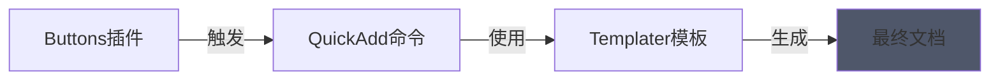

==**这是一个导航页面（Home page）。用于概括仓库状况。并非正文或正文之一部分/前言/后记。**==

## 关于仓库

> 快速生成：
> 
> 本仓库使用obsidian打包仓库快速生成。导航页参考了 [导航页搭建](https://forum-zh.obsidian.md/t/topic/19379) ，日记模板参考了 [日记模板](https://forum-zh.obsidian.md/t/topic/22960) 。

……（随便写点什么介绍。比如你要将这里打造为obsidian模范仓库）

（关系图谱……）

（请任意修改任何内容，加入各种链接……爱好……待办……一切……直到我们死去为止。）

**对了，别的你都可以不要管就算了，有一件事你务必注意：参考的文章不要硬写死到正文里，而是要单独放在一个文件里，然后和正文搞双向链接嵌入模式。不然正文里面夹杂大量参考会==非常，非常==混乱！**

也就是实现原创、非原创内容的分离。除此外就没啥了。

> [!note]+ 参见：本仓库启用的插件
> 
> ```dataviewjs
> const plugins = app.plugins.enabledPlugins;
> const manifests = app.plugins.manifests;
> dv.table(
>     ["№", "🔌 插件名称", "📝 描述"],
>     Array.from(plugins).map((p, i) => [
>         i+1, 
>         p,
>         manifests[p]?.description || "暂无描述"
>     ])
> )
> ```

## 快捷操作

![[🛠️常用工具 My Tools]]


【快捷操作被封装在buttons插件的command中，请在==阅读视图==下查看】


[Buttons插件]([[按钮集【普通按钮】]])    [QuickAdd命令]([[]])


立刻创建一篇说说：`button-zone` 

前往各种有用的论坛。有用。也许吧：`button-pkmer` `button-Obsidian` 

## 文档管理办法

本仓库的文档管理办法约定如下：

1. 【强制】绝不可以出现obsidian**仓库套仓库**，==绝不==。
2. 【强制】长篇的非原创内容，一律标明“参考来源”，==写入一个单独的文档==，以==双向链接的形式嵌入正文==。

1. 【建议】短篇的非原创内容，使用Ad块或者一般引用块进行包裹。
2. 【建议】插入截图前，使用箭头、方框标明截图中的重点。插入后，使用captions插件撰写图片注释。
3. 【建议】在gitee、github，无论是否公开，都进行备份或同步。
4. 【建议】多写metadata和双向链接。

## 概览

日记模板：[[【闪念模板】ZONE]]

绿墙/热力图/活动历史图/贡献图。插件contribution-graph由国人制作。由youtube 
Marco Serafini频道的影片推荐。

```contributionGraph
title: Contributions
graphType: default
dateRangeValue: 12
dateRangeType: LATEST_MONTH
startOfWeek: 1
showCellRuleIndicators: true
titleStyle:
  textAlign: left
  fontSize: 18px
  fontWeight: normal
dataSource:
  type: PAGE
  value: ""
  dateField: {}
fillTheScreen: false
enableMainContainerShadow: false
cellStyleRules: []

```

### 年年今日

```dataviewjs
const now = new Date();
const formattedTime = now.toISOString().slice(0, 16).replace("T", " ");
const month = now.getMonth() + 1;
const hour = now.getHours();

// 判断季节
let season = month >= 11 || month <= 2 ? "冬季" : month >= 3 && month <= 5 ? "春季" : month >= 6 && month <= 8 ? "夏季" : "秋季";

// 判断时间段
let timePeriod = hour >= 0 && hour < 6 ? "凌晨" : hour >= 6 && hour < 12 ? "上午" : hour >= 12 && hour < 14 ? "晌午" : hour >= 14 && hour < 18 ? "下午" : "晚上";

// 输出结果
dv.span(`<b>当前时间：${formattedTime}。假设在郑州，那么现在的季节：${season}，时间段：${timePeriod}。</b><br>（统计代码由deepseek生成。我与cursor扯皮三个小时，没结果，真傻逼。）`);
```


```dataviewjs
// 获取当前时间
const now = new Date();

// 计算今年的第1天（1月1日）
const startOfYear = new Date(now.getFullYear(), 0, 1);

// 计算今天是今年的第几天
const pastDays = Math.floor((now - startOfYear) / (1000 * 60 * 60 * 24)) + 1;

// 计算今天是今年的第几周
const currentWeek = Math.ceil(pastDays / 7);

// 计算今年总天数（考虑闰年）
const isLeapYear = (now.getFullYear() % 4 === 0 && now.getFullYear() % 100 !== 0) || now.getFullYear() % 400 === 0;
const totalDaysInYear = isLeapYear ? 366 : 365;

// 计算过去了一年中的多少百分比
const pastPercentage = ((pastDays / totalDaysInYear) * 100).toFixed(2);

// 输出结果
dv.paragraph(`假设今年1月1日为第一周，今天是第 **${currentWeek}** 周，也就是说今年已经过去了 **${pastPercentage}%**。`);
```

```dataviewjs
// 获取所有文件
const allFiles = dv.pages().file;

// 统计第一篇文章的创建时间
const firstFile = allFiles.sort(f => f.ctime, 'asc')[0];
const firstFileDate = firstFile.ctime.toFormat("yyyy-MM-dd"); // 使用 Luxon 的 toFormat 方法

// 统计至今有多少篇文章
const totalNotes = allFiles.length;

// 统计当前仓库的总大小（以MB为单位）
let totalSizeBytes = 0;
for (const file of allFiles) {
    if (file.size) {
        totalSizeBytes += file.size;
    }
}
const totalSizeMB = (totalSizeBytes / (1024 * 1024)).toFixed(2); // 转换为MB

// 统计至今有多少个唯一标签
const allTags = allFiles.etags;
const uniqueTags = [...new Set(allTags)]; // 去重
const totalTags = uniqueTags.length;

// 输出结果
// 当前仓库总大小：**${totalSizeMB} MB**【该功能还不准确，修复中】。
// 输出结果（一句话）
dv.paragraph(`第一篇文章创建于 **${firstFileDate}**，自那开始至今共有 **${totalNotes}** 篇文章和 **${totalTags}** 个唯一标签。<br><br>你可以将鼠标/cursor放置在左侧的文件目录上，查看这一数据！`);
```

```dataviewjs
// 获取日期显示
let today = moment().format('YYYY-MM-DD');
let lastYear = moment().subtract(1, 'years').format('YYYY-MM-DD');

dv.paragraph(`<div style="display: flex; justify-content: space-between; margin-bottom: 20px;">
    <div>📅 今天是：<b>${today}</b></div>
    <div>📆 一年前：<b>${lastYear}</b></div>
</div>`);

dv.header(3, "📝 历史上的今天");

// 获取符合条件的文件，并将其转换为数组
let files = Array.from(dv.pages().where(p => dv.date(p.file.ctime).toFormat("MM-dd") === dv.date(today).toFormat("MM-dd")));

// 计算总字数
let totalWords = files.reduce((sum, file) => sum + (file.file.size || 0), 0);

// 显示表格
dv.table(
    ["标题", "创建时间", "字数"],
    files.map(file => [
        file.file.link,
        dv.date(file.file.ctime).toFormat("YYYY-MM-DD HH:mm"),
        file.file.size || 0
    ])
);

// 在表格末尾添加总字数
dv.paragraph(`<div style="margin-top: 10px;"><b>总字数: ${totalWords}</b></div>`);
```

### 最近

**最近编辑**

```dataview
table WITHOUT ID file.link AS "标题",file.mtime as "上次编辑时间"
from !"10 归档" and !"1 看板"
sort file.mtime desc
limit 5
```

**最近创建**

```dataview
table WITHOUT ID file.link AS "标题",file.ctime as "创建时间"
from !"10 归档" and !"1 看板"
sort file.ctime desc
limit 5
```

### 标签

```dataviewjs
// 获取所有标签并统计
let tags = {};
for(let page of dv.pages()) {
    if(!page.file.tags) continue;
    page.file.tags.forEach(tag => {
        tags[tag] = (tags[tag] || 0) + 1;
    });
}

// 排序
let sortedTags = Object.entries(tags).sort((a, b) => b[1] - a[1]);

// 获取前10个最常用的
let topTags = sortedTags.slice(0, 10);
// 获取后10个最不常用的
let bottomTags = sortedTags.slice(-10).reverse();

dv.header(3, "🏷️ 标签统计");

// 分组显示常用标签
dv.header(4, "📈 常用标签 (Top 10)");
dv.table(
    ["#", "标签", "次数"],
    topTags.map(([tag, count], index) => [
        index + 1,
        `\`${tag.replace('#','')}\``,  // 添加代码样式
        count
    ])
);

// 分组显示不常用标签
dv.header(4, "📉 低频标签 (Bottom 10)");
dv.table(
    ["#", "标签", "次数"],
    bottomTags.map(([tag, count], index) => [
        index + 1,
        `\`${tag.replace('#','')}\``,  // 添加代码样式
        count
    ])
);

// 添加总计信息
dv.paragraph(`📊 总计: ${sortedTags.length} 个标签`);
```


## 文档目录

```dataviewjs
function generateFolderTree(depth = 0, parentPath = "") {
    const folders = dv.pages()
        .filter(p => p.file.folder && 
                    p.file.folder.startsWith(parentPath) && 
                    p.file.folder.split("/").length === depth + 1)
        .map(p => p.file.folder)
        .distinct()
        .sort();

    let tree = "";
    const len = folders.length;
    
    folders.forEach((folder, idx) => {
        if (!folder) return;
        const isLast = idx === len - 1;
        const indent = depth > 0 ? "  ".repeat(depth - 1) + (isLast ? "└── " : "├── ") : "";
        tree += `${indent}📁 ${folder.split("/").pop()}\n`;
        
        const subTree = generateFolderTree(depth + 1, folder);
        if (subTree) tree += subTree;
    });
    
    return tree;
}

dv.paragraph(generateFolderTree());
```


## 尾声/寄语

> Dataview可谓是ob用户的必备的插件了，当你积累了10+篇自己的笔记，可以用它来生成目录。
> 
> 在此之前，我想对造轮子说两句（因为dataview是造轮子的利器）。
> 
> 写笔记也好，做什么东西也好，我认为很忌讳的一点是过度设计，废了很大的功夫想要在一切开始之前造一个完美的轮子，结果造完之后极大可能你的记笔记热情已经没有了。
> 
> 所以我不建议你等待，等待任何笔记流程的设计。不是有了完美工作流之后你才能开始工作，而是做着做着就根据自己的场景和需要慢慢铺就了适合你的工作流。
> 
> 这也是渐进式笔记的概念。ob当时带着双链和关系图谱出现，本意就是让使用者渐进式的搭建自己的知识库。
> 
> 渐进式的观点还能很好的改善完美主义。（刚看完《如何成为不完美主义》的一点小启发。）
> 
> 这也就是我为什么说等你积累到10篇以上，会需要这篇文章。如果你才开始记笔记，请先放下一切问题，先记起来。
> 
> *——《[obsidian插件之dataview入门](https://forum-zh.obsidian.md/t/topic/195)》*
’

发奋忘事，乐以忘忧，做起来就什么都不想了，就没力气抱怨命运了。

祝安。

（完）